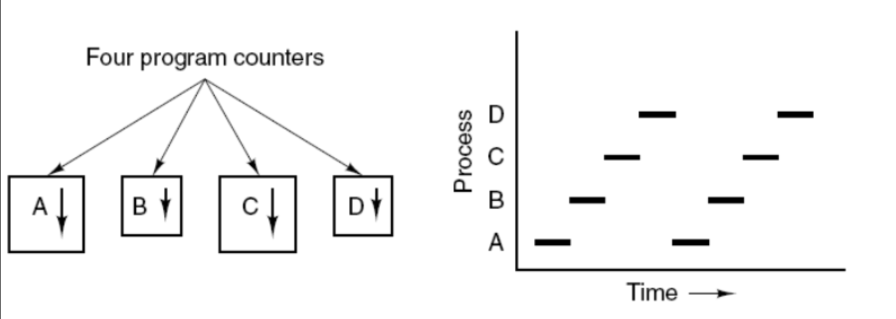
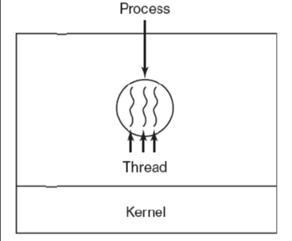
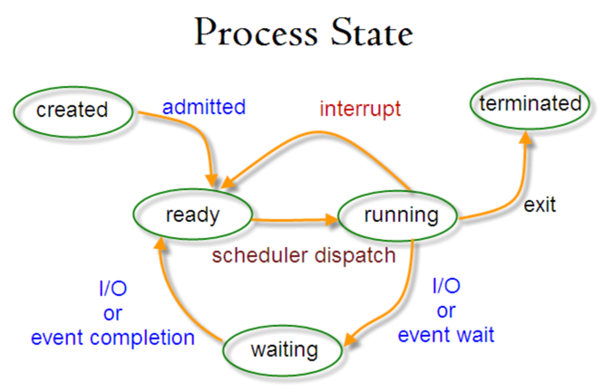
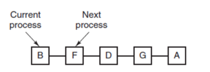
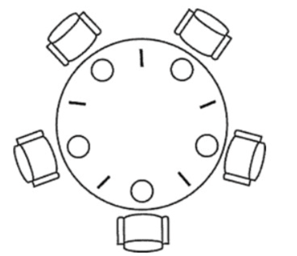

# Computer Operating System - Process Management
<!-- GFM-TOC -->
* [Computer Operating System - Process Management](#Computer Operating System---Process Management)
    * [Process and Thread](#Process And Thread)
        * [1. Process](#1-Process)
        * [2. Thread](#2-Thread)
        * [3. The Difference](#3-Difference)
    * [Process State Switching](#Process State Switching)
    * [Process Scheduling Algorithm](#ProcessS cheduling Algorithm)
        * [1. Batching Processing System](#1-Batching Processing System)
        * [2. Interactive System](#2-Interactive System)
        * [3. Real Time System](#3-Real Time System)
    * [Process Synchronization](#Process Synchronization)
        * [1. Critical Section](#1-Critical Section)
        * [2. Synchronization and Mutual Exclusion](#2-Synchronization and Mutual Exclusion)
        * [3. Semaphore](#3-Semaphore)
        * [4. Monitor](#4-Monitor)
    * [Classic synchronization problem](#Classic synchronization problem)
        * [1. The Dining Philosophers Problem](#1-The Dining Philosophers Problem)
        * [2. Reader-Writer Problem](#2-Reader-Writer Problem)
    * [Process Communication](#Process Communication)
        * [1. Pipe](#1-Pipe)
        * [2. FIFO](#2-fifo)
        * [3. Message Queue](#3-Message Queue)
        * [4. Semaphore](#4-Semaphor)
        * [5. Shared Storage](#5-Shared Storage)
        * [6. Socket](#6-Socket)
<!-- GFM-TOC -->


## Process And Thread

### 1. Thread

A process is the basic unit of resource allocation.

A process control block (Process Control Block, PCB) describes the basic information and running status of a process. Creating and destroying a process both refer to operations on the PCB.

The diagram below shows that four programs create four processes, which can execute concurrently.



### 2. Thread

Threads are the basic unit of independent scheduling.

A process can have multiple threads, which share process resources.

QQ and the browser are two separate processes. The browser process contains many threads, such as HTTP request threads, event response threads, rendering threads, and so on. The concurrent 
execution of these threads allows the browser to respond to other user events while a new link is clicked and an HTTP request is initiated.

### 3. Difference

Ⅰ Resource

A process is the basic unit of resource allocation, but a thread does not own resources; however, 
a thread can access the resources of the process to which it belongs.


Ⅱ Scheduling

Threads are the basic unit of independent scheduling. Within the same process, switching between threads does not
cause a process switch. Switching from a thread in one process to a thread in another process will cause a process switch.

Ⅲ System Overhead

Creating or terminating a process incurs significantly higher overhead than creating or terminating a thread, as the system must 
allocate or reclaim resources such as memory and I/O devices. Similarly, process switching involves saving the CPU environment of the currently executing process and setting the CPU 
environment of the newly scheduled process, while thread switching only requires saving and setting a small number of register contents, resulting in minimal overhead.

Ⅳ Communication

Threads can communicate by directly reading and writing data within the same process, but inter-process communication requires the use of IPC.

## Process State Switching



- Ready state（ready）：Waiting to be scheduled
- Running state（running）
- Waiting State（waiting）：Waiting for resources

The following points should be noted：

- Only the read and running states can transition between each other; all other transitions are unidirectional. A process in the ready state gains CPU time 
 through the scheduling algorithm and transitions to the running state; a process in the running state transitions to the ready state after its allocated CPU time slice is used up, waiting for the next scheduling.
- The blocked state arises from the running state due to a lack of necessary resources, but these resources 
 do not include CPU time. A lack of CPU time will cause the process to transition from the running state to the ready state.


## Process Scheduling Algorithm

The objectives of scheduling algorithms differ in different environments, therefore scheduling
algorithms need to be discussed for different environments.

### 1. Batch Processing System

Batch processing systems do not involve much user interaction. In such systems, the scheduling algorithm aims to 
guarantee throughput and turnaround time(time from submission to termination)

**1.1 first-come first-serverd（FCFS）**

Non-Preemptive scheduling algorithms schedule requests in the order they are requested.
It is beneficial for long jobs, but not for short jobs, because short jobs must wait for the preceding long jobs to finish before
 they can be executed, and long jobs take a long time to execute, resulting in excessively long waiting times for short jobs.

**1.2 shortest job first（SJF）**

Non-preemptive scheduling algorithms schedule jobs in order of their estimated shortest execution time.
Long jobs may starve, remaining in a state of indefinitely waiting for shorter jobs to complete. This is because if short jobs keep arriving, long jobs will never be scheduled.

**1.3 shortest remaining time next（SRTN）**

The shortest job first(SJF) preemptive version schedules jobs in order of remaining runtime. When a new job 
arrives, its total runtime is compared to the remaining runtime of the current process. If the new process requires less time, the current 
process is suspended and the new process runs. Otherwise, the new process waits.

### 2. Interactive System

Interactive systems involve a large number of user interactions, and the goal of scheduling algorithms in such systems
 is to respond quickly.

**2.1 Time slice rotation**

All ready processes are arranged into a queue according to the FCFS(First-Come, First-Served) principle. 
During each scheduling, cpu time is allocated to the process at the head of the queue, which can execute for one time slice. 
When the time slice expires, a clock interrupt is issued by a timer, the scheduler stops the execution of that process, moves it to the end of the ready queue, and continues to allocate CPU time to the process at the head of queue.

The efficiency of the time-slice round-robin algorithm is highly dependent on the size of the time slice:

- Because process switching requires saving the information of the previous process and loading the information 
of the new process, if the time slice is too short, process switching will be too frequent and too much time will be spent on process switching.
- Conversely, if the time slice is too long, real-time performance cannot be guaranteed.



**2.2 Priority Scheduling**
Assign a priority to each process and schedule them according to priority.

To prevent low-priority processes from never being scheduled, the priority of waiting processes can be increased over time.

**2.3 Multi-level feedback queue**

If a process need to execute for 100 time slides, then if the round-robin scheduling algorithm is used, then 100 swaps are required.

Multilevel queues are designed for processes that need to execute continuously for multiple time slices. They consistent of multiple queues, each with different time slice size, such as 1, 2, 4, 8, ... A process is 
moved to the next queue before it finishes executing in the first.in this way, processes only need to be swapped 7 times.
Each queue has a different priority, with the top queue having the highest priority. Therefore, a process in the current queue
 can only be scheduled if there are no processes waiting in the previous queue.

This scheduling algorithm can be viewed as a combination of time-slice round-robin scheduling and priority scheduling.


### 3. Real-time System

Real-time systems require a response to a request within a defined timeframe.

It is divided into hard real-time and soft real-time. The former myst meet the absolute deadline,
while the latter can tolerate a certain timeout.

## Process Synchronization

### 1. Critical section

The code that accesses critical resources is called the critical section.

To ensure exclusive access to critical resources, each process needs to perform a check before entering the critical section.

```html
// entry section
// critical section;
// exit section
```

### 2. Synchronization and Mutual Exclusion

- Synchronization: The direct constraints arising from cooperation among multiple processes result in a certain order of execution.
- Mutual Exclusion: Only one process can enter the critical section at any given time.

### 3. Semaphore

A semaphore is an integer variable that can be subjected to down and up operations, also known as P and V operations.

-   **down**   : If the semaphore is greater than 0, perform a -1 operation; if the semaphore is equal to 0, the process sleeps and waits for the semaphore to be greater than 0.
-   **up**  ：Perform an increment operation on the semaphore to wake up the sleeping process and make it complete the down operation.

The down and up operations need to be designed as primitives and are indivisible. The usual practice is to disable interrupts when performing these operations.

If the value of a semaphore can only be 0 or 1, then it becomes a **Mutex**, where 0 indicates that the critical section is locked and 1 indicates that the critical section is unlocked.

```c
typedef int semaphore;
semaphore mutex = 1;
void P1() {
    down(&mutex);
    // Critical section code
    up(&mutex);
}

void P2() {
    down(&mutex);
    // Critical section code
    up(&mutex);
}
```

\<font size=3\>   **Using semaphores to solve the procedure-consumer problem**   \</font\> \</br\>

Problem description：Use a buffer to store items. Producers can put items in the buffer only if it is not full, and consumers can take items 
only if the buffer is not empty.

Because the buffer is a critical resource, a mutex is needed to control mutually exclusive access to buffer.

To synchronize the behavior of producers and consumers, it's necessary to record the number of items in the buffers.
This quantity can be counted using semaphores; two semaphores are needed: 'empty' to record the number of empty buffers, and 'full' to record
the number of full buffers. The 'empty' semaphore is used in the producer process; the producer can only add items when 'empty' is not 0. 
The 'full' semaphore is used in consumer process; the consumer can only remove items when the 'full' semaphore is not 0.


Note that you cannot lock the buffer before testing semaphore. That is, you cannot execute 'down(mutex)' before 'down(empty)'. If you do,
the following situation might occur: the producer locks the buffer, executes 'down(empty)', finds 'empty=0', and then the producer goes to sleep
. The consumer cannot enter the critical section because the producer has locked the buffer, preventing the consumer from executing 'up(empty)'. 'empty' will always be 0, causing the producer to wait indefinitely without releasing the lock, and the consumer will therefore also wait indefinitely. 

```c
#define N 100
typedef int semaphore;
semaphore mutex = 1;
semaphore empty = N; // how many items can be put
semaphore full = 0;

void producer() {
    while(TRUE) {
        int item = produce_item();
        down(&empty);//if empty is 0, it will be waiting, blocking here
        down(&mutex);//down the mutex
        insert_item(item);
        up(&mutex);
        up(&full); //the message size increase +1
    }
}

void consumer() {
    while(TRUE) {
        down(&full); //the message size in the queue decrease first
        down(&mutex); // lock resource
        int item = remove_item();
        consume_item(item); 
        up(&mutex); // unlock resource
        up(&empty); // increase the number of message can be put in the queue
    }
}
```

JAVA Semaphore based producer-consumer problem

```java

import java.io.InterruptedIOException;
import java.util.ArrayDeque;
import java.util.Queue;
import java.util.concurrent.Semaphore;

public class BoundedBuffer<T> {

    private final int capacity;
    private final Queue<T> items = new ArrayDeque<>();

    private final Semaphore empty; //empty slots
    private final Semaphore full; // filled slots;
    private final Semaphore mutex; // binary semaphore for critical section

    public BoundedBuffer(int capacity) {
        this.capacity = capacity;
        private final Semaphore empty = new Semaphore(capacity); //empty slots
        private final Semaphore full = new Semaphore(0); // filled slots;
        private final Semaphore mutex = new Semaphore(1); // unlocked binary semaphore for critical section

    }

    public void put(T item) throws InterruptedIOException{
        
        empty.acquire();
        mutex.acquire();
        try{
            items.add(T);
        } finally {
            mutex.release(); //leave critical section
            full.release(); //signal one more full slot
        }
        
    }
    
    public T take() throws InterruptedException {
        full.acquire(); // wait for an available item
        mutex.acquire(); 
        Item item = null;
        try{
            item = items.remove();
        } finally {
            mutex.release();
            empty.release();
        }
    }


}

```

### 4. Monitor

The producer-consumer problem implemented using semaphores requires a lot of control in client code.
Monitors isolate the control code, which not only reduces the risk of errors but also makes it easier for the client code to call them.

c 语言不支持管程，下面的示例代码使用了类 Pascal 语言来描述管程。示例代码的管程提供了 insert() 和 remove() 方法，客户端代码通过调用这两个方法来解决生产者-消费者问题。

```pascal
monitor ProducerConsumer
    integer i;
    condition c;

    procedure insert();
    begin
        // ...
    end;

    procedure remove();
    begin
        // ...
    end;
end monitor;
```
Java object monitors was added in JDK 9, 

A key characteristic of monitors is that only one process can use a monitor at any given time. A process cannot continuously
 occupy a monitor if it is unable to continue execution; otherwise, other processes would never be able to use the monitor.

Monitors introduce **condition variables** and related operations: **wait()** and **signal()** to achieve synchronization. Executing the wait() operation on a condition variable 
causes the calling process to block, yielding the monitor to another process. The signal() operation is used to wake up a blocked process.

<font size=3>  **Solving the producer-consumer problem using monitor**  </font><br>

```pascal
// Monitor
monitor ProducerConsumer
    condition full, empty;
    integer count := 0;
    condition c;

    procedure insert(item: integer);
    begin
        if count = N then wait(full);
        insert_item(item);
        count := count + 1;
        if count = 1 then signal(empty);
    end;

    function remove: integer;
    begin
        if count = 0 then wait(empty);
        remove = remove_item;
        count := count - 1;
        if count = N -1 then signal(full);
    end;
end monitor;

// Producer client 
procedure producer
begin
    while true do
    begin
        item = produce_item;
        ProducerConsumer.insert(item);
    end
end;

// Consumer Client 
procedure consumer
begin
    while true do
    begin
        item = ProducerConsumer.remove;
        consume_item(item);
    end
end;
```

Java code to implement producer-consumer 
```java

import java.util.ArrayDeque;
import java.util.Queue;

public class BoundedBuffer<T> {
    private final int capacity;
    private final Queue<T> items = new ArrayDeque<>();
    
    public BoundedBuffer(int capacity){
        this.capacity = capacity
    }
    
    public synchronized void put(T item) throws InterruptedException{
        while(items.size() == capacity){
            wait();
        }
        items.add(item);
        notifyAll();
    }
    
    public synchronized T take() throws InterruptedException{
        while(items.isEmpty()){
            wait();
        }
        T item = items.remove();
        notifyAll();
        return item;
    }
}

```

Producer / Consumer Demo

```java
public static void main(String[] args) {
    BoundedBuffer<Integer> buffer = new BoundedBuffer<>(5);
    
    Runnable producer = ()->{
        int x = 0;
        try{
            while(true){
                buffer.put(x);
                System.out.println(Thread.currentThread().getName() + " produced "+x);
                x++;
                Thread.sleep(100);
            }
        } catch (InterruptedException e){}
    };
    
    Runnable consumer = () ->{
        try{
            while(true){
                int v = buffer.take();
                System.out.println(Thread.currentThread().getName() + " consumed " + v);
                Thread.sleep(150);
            }
        } catch (InterruptedException e){}
    };
    
    new Thread(producer, "P1").start();
    new Thread(producer, "P2").start();
    new Thread(consumer, "C1").start();
    new Thread(consumer, "C2").start();
    
}

```
## Classic Synchronization Problem


### 1. The Dining Philosophers Problem


Problem setup

- 5 philosophers sit around a round table.

- Between each pair of philosophers is 1 fork (so 5 forks total).

- Each philosopher alternates between:
 <br>thinking

 <br>eating

<br>To eat, a philosopher needs both left and right forks.

<br>Goals

<br>Design a protocol so that:

- No deadlock (system never gets stuck).

- No starvation (every philosopher eventually eats).

- Mutual exclusion (a fork can be held by only one philosopher at a time).

### Common solutions
#### Solution A: resource hierarchy(simple, deadlock-free)
Number forks 0..4.<br>
Rule: always pick the lower-numbered fork first, then the higher.

<br>This breaks circular wait.
<br> Pseudocode
```
fork1 = min(left, right)
fork2 = max(left, right)

pick(fork1)
pick(fork2)
eat()
put(fork2)
put(fork1)

```
- ✅ Deadlock-free
- ⚠️ Starvation still possible in extreme scheduling, but uncommon in practice.

#### Solution B: Limit to N−1 philosophers eating (semaphore)

Use a semaphore room initialized to 4(for 5 philosophers)
At most 4 philosophers may try to pick forks at once, so at least
 one philosopher can always get both forks.
Pseudocode
```
room.acquire()

pick(left)
pick(right)
eat()
put(right)
put(left)

room.release()
```


✅ Deadlock-free
✅ Starvation unlikely (depends on fairness of semaphore)

#### Java example (resource hierarchy)
Here is a clean Java version using ReentrantLock forks and ordering:
```java

import java.util.concurrent.locks.ReentrantLock;

class Fork extends ReentrantLock {}

class Philosopher extends Thread {
    private final Fork left, right;
    private final int id;
    
    Philosopher(int id, Fork left, Fork right){
        this.id = id;
        this.left = left;
        this.right = right;
    }
    
    public void run(){
        try {
            while(true){
                think();
                Fork first = left.hashCode() < right.hashCode() ? left : right;
                Fork second = first == left ? right : left;
                
                first.lock();
                try {
                    second.lock();
                    try{
                        eat();
                    } finally {
                        second.unlock();
                    }
                } finally {
                    first.unlock();
                }
            }
            
        } catch (InterruptedException e){}
    }
    
    private void think() throws InterruptedException {
        //simulate thinking
        Thread.sleep((long) (Math.random() * 100));
    }
    
    private void eat() throws InterruptedException {
        System.out.println("Philosohper " + id + " eating");
        Thread.sleep((long)(Math.random() * 100));
    }
}


public class DiningPhilosophers {

    public static void main(String[] args) {
        int n = 5;
        Fork[] forks = new Fork[n];
        for(int i=0; i<n; i++){
            forks[i] = new Fork();
        }
        
        for(int i=0; i<n; i++){
            Fork left = forks[i];
            Fork right = forks[(i+1) % n];
            new Philosophers(i, left, right);
        }
    }
}
```
This enforces a strict fork ordering → no cyclic wait → no deadlock.

#### What this problem teaches
Locks alone aren’t enough; ordering and protocols matter.

Deadlocks come from 4 conditions:

- Mutual exclusion

- Hold and wait

- No preemption

- Circular wait
**Break any one => no deadlock.**

### 2. Reader-Writers problem

The Reader-Writers Problem is a classic synchronization problem in concurrency. It models
a shared data resource accessed by two kinds of threads:
- Readers: only read the data (do not modify it).
- Writers: modify the data.

Goals: Design a protocol so that:
- **Writer-writer mutual exclusion**: at most one writer can write any time.
- **Reader-writer mutual exclusion**: no reader can read while a writer is writing.
- **Reader-reader concurrency**: multiple readers may read simultaneously if no writer is active.
- (Ofer desired) **No starvation/fairness**: neither readers nor writers should wait forever.

#### Common variants
1. Readers-preference
As long as there is at least one reader reading, new readers may enter immediately.
   - Pro: High throughput for reads.
   - Con: writers can starve if readers keep arriving.
2. Writers-preference
If any writer is waiting, new readers are blocked until writers finish.
   - Pro: prevents writer starvation.
   - Con: readers may wait longer
3. Fair(no-starvation)
Readers and writers are served in arrival order (or with a fairness rule), so neither side starves.
    - Pro: balanced, practical for real systems.
    - Con: slightly lower throughput thant pure read- or writer-preference
#### Semaphore solution(Classic readers-preference)
Shared variables and semaphores:
* readCount = number of readers currently reading
* mutex (binary semaphore, init 1): protects readCount
* wrt (binary semaphore, int 1): controls writers(and blocks readers when writing).

Reader:
```text
wait(mutex)
readCount ++;
if readCount == 1
    wait(wrt) //first reader locks out writers
signal(mutex)
... reading ...
wait(mutex)
readCount --
if readCount==0
    signal(wrt) //last reader releases writers
signal(mutex)

```
Writer
```text
wait(wrt)
... writing ...
signal(wrt)

```
**why it works**
- The first reader acquires wrt, blocking writers
- Additional readers only update readCount, so they can read concurrently.
- The last reader release wrt, allowing writers to proceed.

#### Practical Java solution(built-in read-write lock)
Java provides this directly with ReentrantReadWriteLock

```java

import java.util.concurrent.locks.ReentrantReadWriteLock;

public class SharedData {
    private final ReentrantReadWriteLock rw = new ReentrantReadWriteLock(true);
    private int value = 0;
    
    //reader
    public int read(){
        rw.readLock().lock();
        try {
            return value;
        } finally{
            rw.readLock().unlock();
        }
    }
    
    //Writer
    
    publc void write(int newValue){
        rw.writeLock().lock();
        try{
            value = newValue;
        } finally {
            rw.writeLock().unlock();
        }
    }
}

```
* Multiple readers can hold the read lock together.
* Writers need the write lock, which is exclusive
* Fair mode helps prevent starvation.

```c
typedef int semaphore;
semaphore count_mutex = 1;
semaphore data_mutex = 1;
int count = 0;

void reader() {
    while(TRUE) {
        down(&count_mutex);
        count++;
        if(count == 1) down(&data_mutex); // 第一个读者需要对数据进行加锁，防止写进程访问
        up(&count_mutex);
        read();
        down(&count_mutex);
        count--;
        if(count == 0) up(&data_mutex);
        up(&count_mutex);
    }
}

void writer() {
    while(TRUE) {
        down(&data_mutex);
        write();
        up(&data_mutex);
    }
}
```

The first case may result Writer to starve. This case favous Writers i.e no writer, once added to the queue, shall be kept waiting longer than absolutely necessary(only when there are readers that entered the queue before the writer).

```c
int readcount, writecount;                   //(initial value = 0)
semaphore rmutex, wmutex, readLock, resource; //(initial value = 1)

//READER
void reader() {
<ENTRY Section>
 down(&readLock);                 //  reader is trying to enter
 down(&rmutex);                  //   lock to increase readcount
  readcount++;                 
  if (readcount == 1)          
   down(&resource);              //if you are the first reader then lock  the resource
 up(&rmutex);                  //release  for other readers
 up(&readLock);                 //Done with trying to access the resource

<CRITICAL Section>
//reading is performed

<EXIT Section>
 down(&rmutex);                  //reserve exit section - avoids race condition with readers
 readcount--;                       //indicate you're leaving
  if (readcount == 0)          //checks if you are last reader leaving
   up(&resource);              //if last, you must release the locked resource
 up(&rmutex);                  //release exit section for other readers
}

//WRITER
void writer() {
  <ENTRY Section>
  down(&wmutex);                  //reserve entry section for writers - avoids race conditions
  writecount++;                //report yourself as a writer entering
  if (writecount == 1)         //checks if you're first writer
   down(&readLock);               //if you're first, then you must lock the readers out. Prevent them from trying to enter CS
  up(&wmutex);                  //release entry section

<CRITICAL Section>
 down(&resource);                //reserve the resource for yourself - prevents other writers from simultaneously editing the shared resource
  //writing is performed
 up(&resource);                //release file

<EXIT Section>
  down(&wmutex);                  //reserve exit section
  writecount--;                //indicate you're leaving
  if (writecount == 0)         //checks if you're the last writer
   up(&readLock);               //if you're last writer, you must unlock the readers. Allows them to try enter CS for reading
  up(&wmutex);                  //release exit section
}
```

We can observe that every reader is forced to acquire ReadLock. On the otherhand, writers doesn’t need to lock individually. Once the first writer locks the ReadLock, it will be released only when there is no writer left in the queue.

From the both cases we observed that either reader or writer has to starve. Below solutionadds the constraint that no thread shall be allowed to starve; that is, the operation of obtaining a lock on the shared data will always terminate in a bounded amount of time.

```source-c
int readCount;                  // init to 0; number of readers currently accessing resource

// all semaphores initialised to 1
Semaphore resourceAccess;       // controls access (read/write) to the resource
Semaphore readCountAccess;      // for syncing changes to shared variable readCount
Semaphore serviceQueue;         // FAIRNESS: preserves ordering of requests (signaling must be FIFO)

void writer()
{ 
    down(&serviceQueue);           // wait in line to be servicexs
    // <ENTER>
    down(&resourceAccess);         // request exclusive access to resource
    // </ENTER>
    up(&serviceQueue);           // let next in line be serviced

    // <WRITE>
    writeResource();            // writing is performed
    // </WRITE>

    // <EXIT>
    up(&resourceAccess);         // release resource access for next reader/writer
    // </EXIT>
}

void reader()
{ 
    down(&serviceQueue);           // wait in line to be serviced
    down(&readCountAccess);        // request exclusive access to readCount
    // <ENTER>
    if (readCount == 0)         // if there are no readers already reading:
        down(&resourceAccess);     // request resource access for readers (writers blocked)
    readCount++;                // update count of active readers
    // </ENTER>
    up(&serviceQueue);           // let next in line be serviced
    up(&readCountAccess);        // release access to readCount

    // <READ>
    readResource();             // reading is performed
    // </READ>

    down(&readCountAccess);        // request exclusive access to readCount
    // <EXIT>
    readCount--;                // update count of active readers
    if (readCount == 0)         // if there are no readers left:
        up(&resourceAccess);     // release resource access for all
    // </EXIT>
    up(&readCountAccess);        // release access to readCount
}

```

## Process Communication

Process synchronization and process communication are easily confused. The differences are:

- Process synchronization: controlling the execution of multiple processes in a specific order;
- Process communication: transferring information between processes

Process communication (often called Inter-Process Communication, IPC) is how separate processes exchange data and coordinate actions. Because
 processes have separate address spaces, they can't just read/write each other's memory directly, so te OS provide controlled mechanisms.
### Why processes need communication
Processes communicate to:
- Share data: (e.g., a browser process sending a network response to a render)
- Coordinate work (e.g., parent/child processes in a pipeline)
- Synchronize access to resources (avoid races, deadlocks)
### Two main Inter-processes communication(IPC) models
#### Shared Memory Model
processes communicate by reading/writing a shared region of memory.<br>
How it works
- OS creates a shared memory segment.
- Both(or more) processes map it into their address space(地址空间).
- They exchange data through it.
- They must use synchronize(semaphores/mutex/monitors) to prevent races.
Pros:
  - very fast(no data copying after setup)
  - Good for large or frequent data exchange
Cons:
  - Harder to program correctly(need explicit synchronization).
  - Bugs can corrupt shared state
Typical use
  - Multimedia buffers, high-performance computing, database.

### Message Passing Model
Processes communicate by sending and receiving messages via OS primitives(操作元语).<br>
How it works:
- send (destination, message)
- receive(source, message)
Message can be:
- Direct: process A sends to process B explicitly
- Indirect: Via mailbox/port/queue.
Pros:
- Easier to reason about(no shared state).
- works across machines(distributed systems).

Cons:
- Slower than shared memory(often involves copying and kernel transitions).
- Message size limits.
Typical use:
- Client-Server systems, microservice, distributed apps.

Quick rule of thumb

- Use shared memory when you need high throughput / large data and can manage synchronization.
- Use message passing when you want simplicity, safety, or distribution.

### Semaphore/Mutex/monitors
#### Semaphore
A semaphore is an integer counter managed atomically by the OS/runtime, used to control access to shared resource.
<br>Types:
- Counting Semaphore(value >= 0):
  - Controls access to N identical resources.
  - Example: a pool of 10 connections.
- Binary semaphore (0 or 1):
  - Similar to a mutex, but not quite the same.
<br> Operations
  - P() / wait() / acquire(): Decrement counter; if it becomes negative(or is 0), block.
  - V() / signal() / release(): increment counter; wake one blocked thread if any.
<br> Key properties
  - No ownership rule: any thread can signal() even if it didn't wait().
  - Can represent resource counts and also event ordering.
<br> Typical use
  - Bounded buffers, limiting concurrency, ordering constraints.

#### Mutex (Mutual Exclusion Lock)
A mutex is a lock that enforces mutual exclusion: only one thread can enter a critical section at a time.
<br> Operations:
- lock() / acquire()
- unlock() / release()
<br> Key properties
- Ownership: the thread that locks must unlock.
- Usually binary (locked/unlocked)
- May support:
  - fairness policies
  - priority inheritance (OS level)
  - reentrancy (depends on implementation)
<br> Typical use
  - Protecting a shared variable or data structure.

#### Monitor
A monitor is a higher-level synchronization abstraction that bundles:
- A mutex (lock)
- Condition variable (wait/notify mechanisms)
- Shared state + methods

In other words: A monitor = mutex + condition queues + protected data packaged together.<br>

Operations (conceptual)
- Enter monitor (lock)
- Exit monitor (unlock)
- wait(): release lock + sleep on condition
- signal() / notify(): wake waiting thread

Key properties
- Automatic mutual exclusion: only one thread runs inside the monitor at once.
- Structured waiting: conditions are tied to the monitor.
- Safer and easier to reason about than raw semaphores.

Typical use
- Classic concurrency problems: producer-consumer, readers-writers, dining philosophers.

### Quick comparison table

|  Feature | Semaphore  | Mutex  | Monitor  |
|---|---|---|---|
| Main purpose | Resource counting / ordering  |  Mutual exclusion | Mutual exclusion + condition synchronization  |
| Value  | Integer (0..N)  | Binary  | Abstraction (internally a mutex)  |
| Ownership  | No (any thread can signal)  | Yes (locker must unlock)  | Yes (via its lock)  |
| Supports waiting on conditions | Indirectly (by protocol)  | Not by itself  | Yes, built-in  |
| Ease of use  | Low–medium (error-prone)  |  Medium |  High (structured) |
| Risk of bugs | High (missed signal, deadlock)  | Medium  | Lower  |


### Relationships (important intuition)
- A mutex is basically a binary lock.
- A binary semaphore can behave like a mutex, but because it has no ownership, it's more flexible and more dangerous
- A monitor internally uses a mutex, plus condition queue for support wait/notify

### Java Mapping 
#### Monitor
JAVA'S synchronized + wait/notify/notifyAll
```

synchronized(lock) {
    while(!condition) lock.wait();
    //critical section
    lock.notify();
}

```

#### Mutex
ReentrantLock

```


Lock lock = new ReentrantLock();
lock.lock();
try{
    ... 
} finally {
    lock.unlock();
}


```
#### Semaphore
java.util.concurrent.Semaphore

```

Semaphore s = new Semaphore(3);
s.acquire();
try{
    .....
} finally{
    s.release();
}

```

### When to choose what
- Use mutex/lock when: you just need exclusive access to a shared thing.
- Use semaphore when: you need to limit concurrency to N, or express ordering("A must happen before b")
- Use monitor when: you want to cleanest, structured way to guard state and wait for conditions

### 1. Pipe(管道)

#### what is a pipe?
A pipe is a simple one-way communication channel used for Inter-Process Communication(IPC). Think of it as:
- A byte stream where one process writes data into one end, and another process reads that data from the other end.
The operating system provides and manages this channel.

#### Key characteristics
- Unidirectional(one-way)
  - One side is for writing, the other for reading
  - If you want two-way communication, you normally use two pipes.
- Byte stream
  - A pipe is just a sequence of bytes, not structured messages.
  - If process A writes 100 bytes, process B may read them in chunks (e.g., 60 bytes, then 40 bytes)
- Kernel buffer
  - The pipe has a buffer in the kernel 
  - If the buffer is full and process tries to write, it blocks (waits).
  - If the buffer is empty and a process tries to read, it blocks (waits).
- Process communication
  - Typically, between related processes(like parent and child) using an anonymous pipe.
  - Or between any processes using a named pipe(FIFO).

#### Anonymous pipes
These are the classic pipes used in shells.
- In Unix-like systems, you create a pipe using pipe(fd): 
  - fd[0] = read end
  - fd[1] = write end
- Usually used with fork(): Parent and child processes share the pipe fds.

Example in a shell

```shell

ls | grep txt

```
What the shell roughly does:

- Creates a pipe. 
- Forks two processes:
  - One runs ls and redirects its stdout to the write end of the pipe. 
  - One runs grep txt and connects its stdin to the read end of the pipe.
- ls writes output into the pipe, grep reads from it.
So | is implemented using a pipe underneath.

#### Named pipes (FIFO)
A named pipe(FIFO) is a pipe that has a name in the filesystem, e.g., /tmp/myfifo
- Created with something like:
```bash

mkfifo /tmp/myfifo

```
- Any two unrelated processes can open that path:
  - One opens it for writing.
  - Another opens it for reading.

Example:
```bash

#Terminal 1
mkfifo /tmp/fifo
echo "hello" >/tmp/fifo

#Terminal 2
cat /tmp/fifo

```
Terminal 2 will print hello

#### Pipe and producer-consumer
A pipe is a natural implementation of the producer-consumer pattern:
- Producer process: writes data into the pipe
- Consumer process: reads data from the pipe

Because:
- When the buffer is full, the producer blocks, waits for consumer.
- When the buffer is empty, the consumer blocks, waits for producer.

### Comparison with  IPC mechanisms

| Mechanism  | Shared memory?  | Blocking behavior built-in?  | Cross-machine?  | Typical use  |
|---|---|---|---|---|
| Pipe  | No  | Yes (blocking read/write)  | No  | Simple parent–child pipelines  |
| Named pipe  | No  |  Yes | No  | Any local processes  |
| Shared memory  |  Yes | No (you must synchronize)  | No  | High-speed large data transfer  |
| Socket  |  No |  Yes (or non-blocking) | Yes  |  Network + local IPC |

