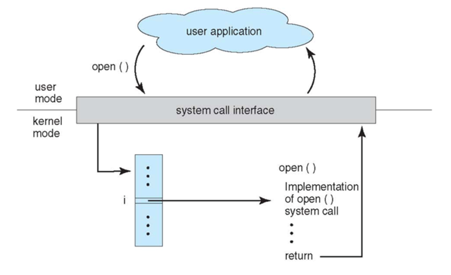
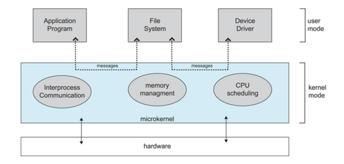

# Computer Operating Systems – Overview
<!-- GFM-TOC -->
* [Computer Operating Systems – Overview](#ComputerOperatngSystemOverview)
    * [Basic Characteristics](#Basic Characteristics)
        * [1. Concurrent](#1-Concurrent)
        * [2. Sharing](#2-Sharing)
        * [3. Virtualization](#3-Virtualization)
        * [4. Asynchronous](#4-Asynchronous)
    * [Fundamental Functions](#Fundamental-Functions)
        * [1. Process Management](#1-process-management)
        * [2. Memory Management](#2-memory-management)
        * [3. File Management](#3-file-management)
        * [4. Device Management](#4-device-management)
    * [System Call](#system-call)
    * [Monolithic Kernel and Microkernel](#Monolithic-Kernel-And-Microkernel)
        * [1. Monolithic Kernel](#1-monolithic-kernel)
        * [2. Microkernel](#2-microkernel)
    * [中断分类](#中断分类)
        * [1. 外中断](#1-外中断)
        * [2. 异常](#2-异常)
        * [3. 陷入](#3-陷入)
<!-- GFM-TOC -->

## Basic Characteristics

### 1. Concurrent

Concurrency refers to the ability to run multiple programs simultaneously over a period of time, while parallelism refers to the ability to run multiple instructions at the same time.

Parallelism requires hardware support, such as multi-pipeline, multi-core processor or distributed computing system

The operating system enables programs to run concurrently by introducing processes and threads.

### 2. Sharing

Sharing means that resources in the system can be used jointly by multiple concurrent processes.

There are two modes of sharing: exclusive sharing and simultaneous sharing.

Mutually exclusive shared resources are called critical resources, such as printers. Only one process is allowed to access them at the same time, and a synchronization mechanism is required to achieve mutual exclusive access.

### 3. Virtualization

Virtualization technology converts a physical entity into multiple logical entities.

There are two main virtualization techniques: time-division multiplexing and space-division multiplexing.
Time-division multiplexing allows multiple processes to run concurrently on the same processor. Each process takes turns using the processor, executing only for a small
time slice before quickly switching.
Virtual memory uses space-division multiplexing. It abstracts physical memory into address spaces, giving each process its own address space. The pages of an address space are mapped to physical memory, but not all pages need to reside in physical memory at the same time.
When a page that is not in physical memory is accessed, a page replacement algorithm is executed to bring that page into memory.

### 4. Asynchronous

Asynchrony means that a process does not complete its execution all at once, but instead proceeds in a stop-and-go manner, advancing that an unpredictable speed

## Fundamental-Functions

### 1. Process-Management

Process management involves process control, process synchronization, inter-process communication(IPC), deadlock handling, and processor scheduling.

### 2. Memory-Management

The main functions of memory management include memory allocation, address mapping, memory protection and sharing, and virtual memory.

### 3. File-Management

The main functions of file management include file storage space management, directory management, file read/write management, and file protection.

### 4. Device-Management

Device management is responsible for fulfilling users' I/O requests, making it easier for users to operate various devices,
and improving device utilization. Its main functions include buffer management, device allocation, device handling, and support for virtual devices.

## System-call

When a process in user mode need to use kernel-mode functions, it makes a system call to trap into kernel, where the
operating system performs the requested operation on its behalf.

  
 

The main system calls in Linux include the following：

|          Task           | Commands |
|:-----------------------:| --- |
|     Process Control     | fork(); exit(); wait(); |
|  Process Communication  | pipe(); shmget(); mmap(); |
|     File operations     | open(); read(); write(); |
|    Device Operations    | ioctl(); read(); write(); |
| Information Maintenance | getpid(); alarm(); sleep(); |
|        Security         | chmod(); umask(); chown(); |

## Monolithic-Kernel-And-Microkernel

### 1. Monolithic-Kernel

A monolithic kernel places all operating system functions into the kernel as a tightly integrated whole.
Since all modules share information, it provides very high performance.

### 2. Microkernel

As operating systems grew increasingly complex, part of the OS functionality was moved out of the kernel to reduce kernel complexity.
the removed components were divided into several independent services according to layering principles.
In a microkernel structure, the operating system is divided into small, well-defined modules. Only the mocrokernel itself runs in kernel model, while all other
modules run in user mode.
Because frequent switches between user mode and kernel model are required, there is some performace overhead.

  
 

## Interrupt classification

### 1. External-Interrupts

Caused by events outside the CPU's instruction execution, such as I/O completion interrupts, which indicate the evice input/output processing has finished
and the processor can issue the next I/O request. Other examples include the clock interrupts and console interrupts.

### 2. Exceptions

Caused by internal events during CPU instruction execution, such as illegal opcodes, address out-of-bounds, and arithmetic overflow.

### 3. Traps

Triggered by system calls made within user programs.